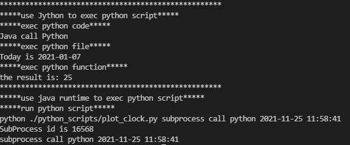

## 1 Introduction

Use Jython to call python modules and functions, use runtime to call python scripts, and package them.

## 2 Folder Structure

The workspace contains two folders by default, where:

- `src`: the folder to maintain sources
- `lib`: the folder to maintain dependencies, and `jython-standalone-2.7.2.jar` is main dependency
- `python_scripts`: the folder to maintain python scripts

Meanwhile, the compiled output files will be generated in the `bin` folder by default.

> If you want to customize the folder structure, open `.vscode/settings.json` and update the related settings there.

## 3 Experimental Results

